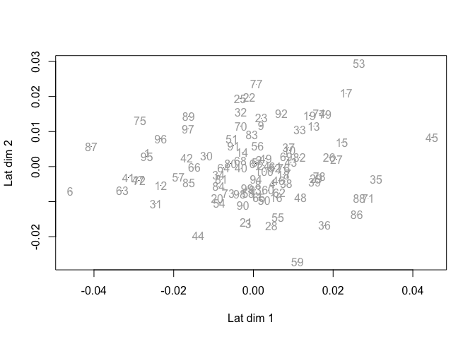

<!-- README.md is generated from README.Rmd. Please edit that file -->

# UCONN

## Installation

You can install the development version of UCONN from
[GitHub](https://github.com/) with:

``` r
# install.packages("devtools")
devtools::install_github("TheoreticalEcology/UCONN")
```

## Example

This is a basic example which shows you how to solve a common problem:

``` r
library(UCONN)
n = 100
sp = 10
e = 2
X = mvtnorm::rmvnorm(n, sigma = diag(1.0, e))
w = mvtnorm::rmvnorm(sp, sigma = diag(1.0, e))
sigma = cov2cor(rWishart(1, sp, Sigma = diag(1.0, sp))[,,1])
Y = 1*(X %*% t(w) + mvtnorm::rmvnorm(n, sigma = sigma) < 0 )

model = uconn(Y, X)
#> Epoch: 60/200 ■■■■■■■■■■                       ETA:  2s Train: 4.7568Epoch: 61/200 ■■■■■■■■■■                       ETA:  3s Train: 4.7784Epoch: 74/200 ■■■■■■■■■■■■                     ETA:  2s Train: 4.7457Epoch: 87/200 ■■■■■■■■■■■■■■                   ETA:  2s Train: 4.7059Epoch: 99/200 ■■■■■■■■■■■■■■■■                 ETA:  2s Train: 4.7054Epoch: 114/200 ■■■■■■■■■■■■■■■■■■               ETA:  2s Train: 4.6848Epoch: 124/200 ■■■■■■■■■■■■■■■■■■■■             ETA:  1s Train: 4.6691Epoch: 135/200 ■■■■■■■■■■■■■■■■■■■■■            ETA:  1s Train: 4.6472Epoch: 150/200 ■■■■■■■■■■■■■■■■■■■■■■■          ETA:  1s Train: 4.6281Epoch: 165/200 ■■■■■■■■■■■■■■■■■■■■■■■■■■       ETA:  1s Train: 4.6139Epoch: 179/200 ■■■■■■■■■■■■■■■■■■■■■■■■■■■■     ETA:  0s Train: 4.5951Epoch: 194/200 ■■■■■■■■■■■■■■■■■■■■■■■■■■■■■■   ETA:  0s Train: 4.5902Epoch: 200/200 ■■■■■■■■■■■■■■■■■■■■■■■■■■■■■■■  ETA:  0s Train: 4.5819
model
#>           latent_1     latent_2
#> env_1 0.0003931115 3.629851e-05
#> env_2 0.0002011056 2.187281e-04
plot(model)
```


